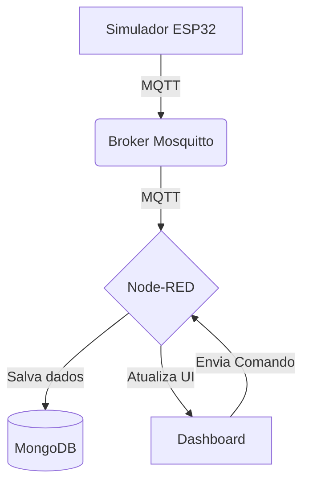

# Sistema de Monitoramento de Vibração - Célula 07 (Trabalho 3)

Este repositório contém o código-fonte e as instruções para executar o sistema de monitoramento de vibração desenvolvido para o Trabalho 03 da disciplina de IoT. O sistema utiliza um simulador de dispositivo em Python, um broker MQTT, Node-RED e MongoDB para criar uma solução completa de monitoramento.

## 🚀 Visão Geral da Arquitetura

O sistema é composto por quatro componentes principais que se comunicam via MQTT:

1.  **Simulador do Dispositivo (`esp32_simulator.py`)**: Um script Python que simula um sensor de vibração da Célula 07. Ele publica dados de telemetria e responde a comandos.
2.  **Broker MQTT (Mosquitto)**: O intermediário de mensagens que desacopla os produtores e consumidores de dados.
3.  **Node-RED (`flows_final.json`)**: A plataforma de *low-code* que orquestra o fluxo de dados, processa as informações, armazena no banco de dados e alimenta o dashboard.
4.  **MongoDB**: O banco de dados NoSQL utilizado para persistir os dados de telemetria e eventos.



## 🛠️ Pré-requisitos

Para executar este projeto, você precisará ter os seguintes softwares instalados em seu ambiente (recomenda-se um sistema baseado em Debian/Ubuntu):

- **Python 3.8+** e `pip`
- **Mosquitto MQTT Broker**
- **Node.js e Node-RED**
- **MongoDB**

Você pode instalar os serviços com os seguintes comandos:

```bash
# Instalar Mosquitto
sudo apt-get update
sudo apt-get install -y mosquitto mosquitto-clients

# Instalar MongoDB
sudo apt-get install -y mongodb

# Instalar Node-RED (via npm)
sudo npm install -g --unsafe-perm node-red
```

## ⚙️ Como Executar o Projeto

Siga os passos abaixo para configurar e executar o sistema completo.

### Passo 1: Clonar o Repositório

```bash
git clone https://github.com/<SEU_USUARIO>/celula07-vibracao-trabalho3.git
cd celula07-vibracao-trabalho3
```

### Passo 2: Configurar o Ambiente Python

É altamente recomendável usar um ambiente virtual para instalar as dependências Python.

```bash
# Criar e ativar o ambiente virtual
python3 -m venv venv
source venv/bin/activate

# Instalar as dependências
pip install -r requirements.txt
```

### Passo 3: Configurar e Iniciar os Serviços

1.  **Mosquitto**: Copie o arquivo de configuração fornecido para o diretório do Mosquitto e reinicie o serviço.

    ```bash
    sudo cp mosquitto.conf /etc/mosquitto/conf.d/default.conf
    sudo systemctl restart mosquitto
    ```

2.  **MongoDB**: Inicie o serviço do MongoDB.

    ```bash
    sudo systemctl start mongod
    ```

3.  **Node-RED**: Inicie o Node-RED. É recomendável executá-lo em um terminal separado ou em background.

    ```bash
    node-red
    ```

### Passo 4: Importar o Flow no Node-RED

1.  Acesse a interface do Node-RED em seu navegador: `http://localhost:1880`.
2.  Clique no menu no canto superior direito (☰) e selecione **Import**.
3.  Clique em **select a file to import** e escolha o arquivo `flows_final.json` deste repositório.
4.  Clique em **Import** e, em seguida, no botão vermelho **Deploy** no canto superior direito.

Após o deploy, você deverá ver os nós MQTT com o status "connected".

### Passo 5: Iniciar o Simulador do Dispositivo

Com o ambiente virtual Python ativado, execute o script do simulador:

```bash
python esp32_simulator.py
```

Você deverá ver no terminal as mensagens de conexão MQTT e os dados de telemetria sendo publicados a cada 3 segundos.

### Passo 6: Acessar o Dashboard

Finalmente, acesse o dashboard para visualizar os dados em tempo real:

- **URL**: `http://localhost:1880/ui`

O dashboard exibirá:
- Um **gauge** com o índice de vibração atual.
- O **status** do dispositivo (Normal, Atenção ou Crítico).
- Um **gráfico** com o histórico de vibração.
- Uma **tabela** com os eventos recentes.
- Botões para enviar **comandos** ao dispositivo.

## 🔧 Estrutura de Tópicos MQTT

O sistema utiliza uma estrutura de tópicos hierárquica para organizar as mensagens:

- **Tópico Base**: `iot/riodosul/si/BSN22025T26F8/cell/7/device/c07-nicolas_gabriela/`

- **Tópicos Específicos**:
  - `.../telemetry`: Para dados de telemetria (vib_index, status).
  - `.../event`: Para eventos importantes (mudança de status, alarmes).
  - `.../state`: Para o estado de conexão do dispositivo (online/offline).
  - `.../cmd`: Para receber comandos do Node-RED.
  - `.../config`: Para publicar a configuração atual do dispositivo.

## 📄 Arquivos no Repositório

- `esp32_simulator.py`: O código do simulador do dispositivo IoT.
- `flows_final.json`: O flow completo para ser importado no Node-RED.
- `mosquitto.conf`: Arquivo de configuração para o broker Mosquitto.
- `requirements.txt`: Dependências Python do projeto.
- `README.md`: Este arquivo de instruções.

## 👨‍💻 Autores

- **Nicolas Marquez Dalfovo**
- **Gabriela da Silva de Liz**
