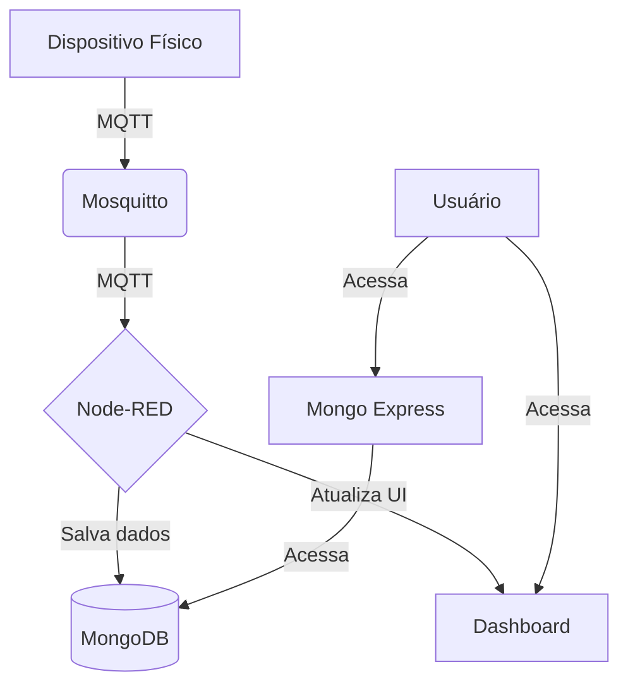

# Sistema de Monitoramento de Vibração - Célula 07 (Trabalho 3)

Este repositório contém a infraestrutura como código para o sistema de monitoramento de vibração da Célula 07. A solução utiliza Docker Compose para orquestrar os serviços necessários (Mosquitto, Node-RED, MongoDB e Mongo Express), facilitando o deploy e a execução do ambiente para receber e processar dados de um dispositivo físico.

## 🚀 Visão Geral da Arquitetura

O sistema é composto por quatro serviços containerizados que se comunicam em uma rede Docker privada:

1.  **Mosquitto**: Broker MQTT que recebe os dados do dispositivo físico.
2.  **Node-RED**: Plataforma de *low-code* que assina os tópicos MQTT, processa os dados, armazena no MongoDB e alimenta o dashboard.
3.  **MongoDB**: Banco de dados NoSQL para persistir os dados de telemetria e eventos.
4.  **Mongo Express**: Interface web para visualizar e gerenciar os dados no MongoDB.



## 🛠️ Pré-requisitos

Para executar este projeto, você precisará ter os seguintes softwares instalados em sua máquina:

- **Docker**
- **Docker Compose**

## ⚙️ Como Executar o Projeto

Siga os passos abaixo para configurar e executar o sistema completo.

### Passo 1: Clonar o Repositório

```bash
git clone https://github.com/Nicolas-Dalfovo/celula07-vibracao-trabalho3.git
cd celula07-vibracao-trabalho3
```

### Passo 2: Iniciar os Serviços com Docker Compose

Dentro do diretório do projeto, execute o seguinte comando para iniciar todos os serviços em background:

```bash
docker-compose up -d
```

O Docker Compose irá baixar as imagens necessárias e iniciar os quatro containers. Para verificar se todos os serviços estão rodando, use o comando:

```bash
docker-compose ps
```

### Passo 3: Acessar os Serviços

Após iniciar os containers, você pode acessar as interfaces web dos serviços:

- **Node-RED**: `http://localhost:1880`
  - O flow (`flows_final.json`) já estará importado e pronto para uso.

- **Dashboard Node-RED**: `http://localhost:1880/ui`
  - O dashboard começará a exibir os dados assim que o dispositivo físico começar a publicar no broker MQTT.

- **Mongo Express**: `http://localhost:8081`
  - Permite visualizar a database `iot_celula07` e as coleções `telemetry` e `events`.

### Passo 4: Configurar o Dispositivo Físico

Configure o seu dispositivo físico (ESP32/ESP8266) para publicar os dados no broker MQTT no seguinte endereço:

- **Broker IP/Hostname**: O endereço IP da máquina que está rodando o Docker.
- **Porta**: 1883

O dispositivo deve publicar nos tópicos MQTT definidos na seção abaixo.

## 🔧 Estrutura de Tópicos MQTT

O sistema espera que o dispositivo físico publique os dados na seguinte estrutura de tópicos:

- **Tópico Base**: `iot/riodosul/si/BSN22025T26F8/cell/7/device/c07-nicolas_gabriela/`

- **Tópicos Específicos**:
  - `.../telemetry`: Para dados de telemetria (JSON com `vib_index`, `status`, etc.).
  - `.../event`: Para eventos importantes (mudança de status, alarmes).
  - `.../state`: Para o estado de conexão do dispositivo (online/offline).

O Node-RED também pode enviar comandos para o dispositivo através do tópico `.../cmd`.

## 📄 Arquivos no Repositório

- `docker-compose.yml`: Arquivo de orquestração dos serviços Docker.
- `flows_final.json`: O flow completo para ser importado no Node-RED.
- `mosquitto.conf`: Arquivo de configuração para o broker Mosquitto.
- `README.md`: Este arquivo de instruções.

## 👨‍💻 Autores

- **Nicolas Marquez Dalfovo**
- **Gabriela da Silva de Liz**
